# System Architecture & Workflow Diagrams

## 1. Overall System Architecture

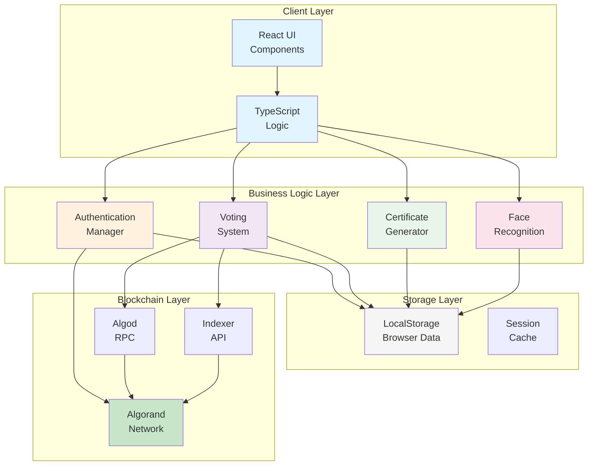

---

## 2. Component Architecture Diagram

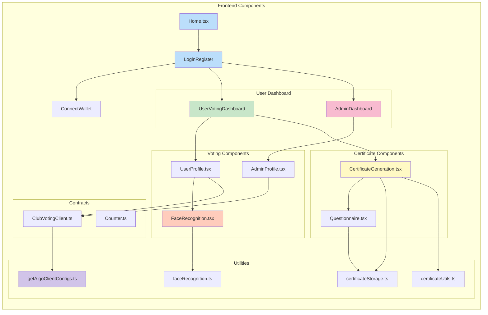

---

## 3. Voting System Workflow

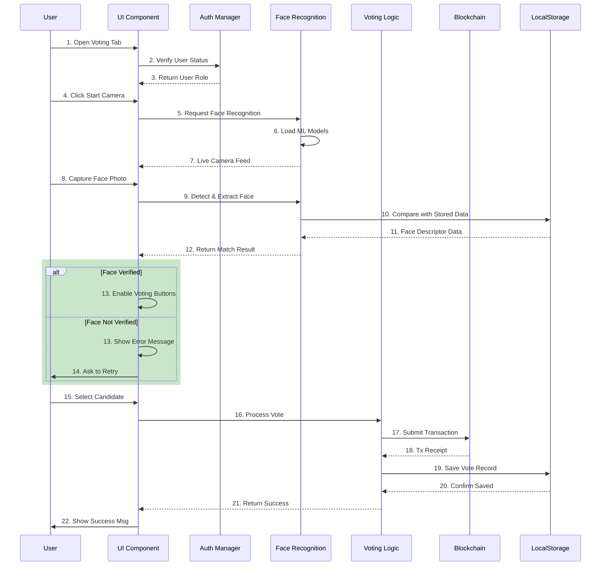

---

## 4. Certificate Generation Workflow

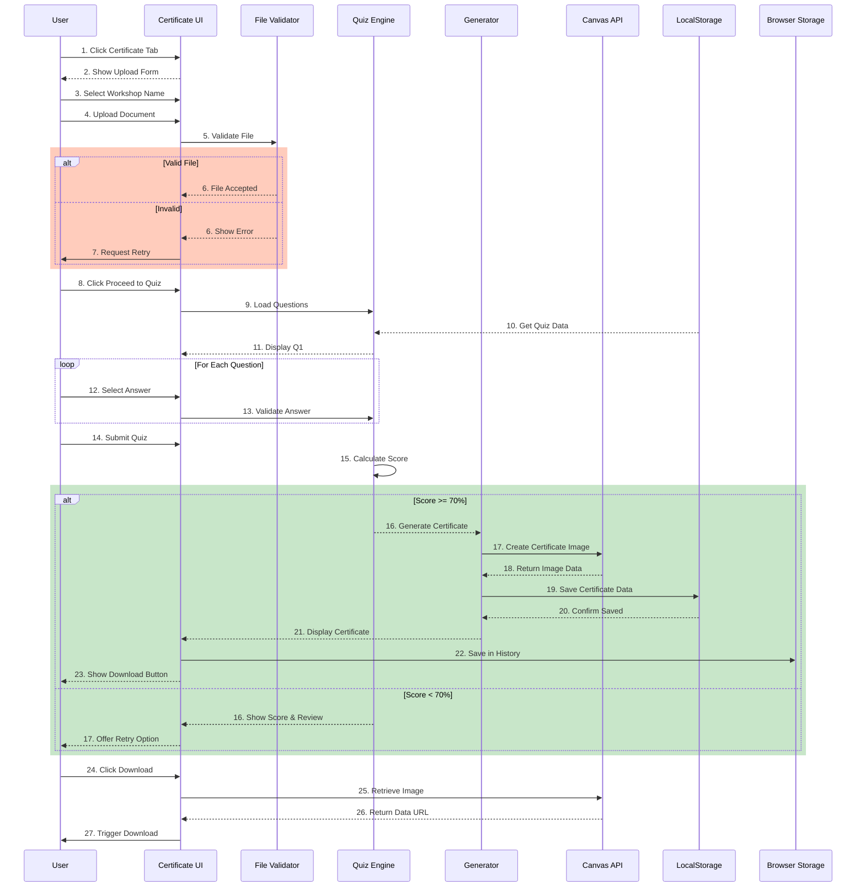

---

## 5. Data Flow Diagram

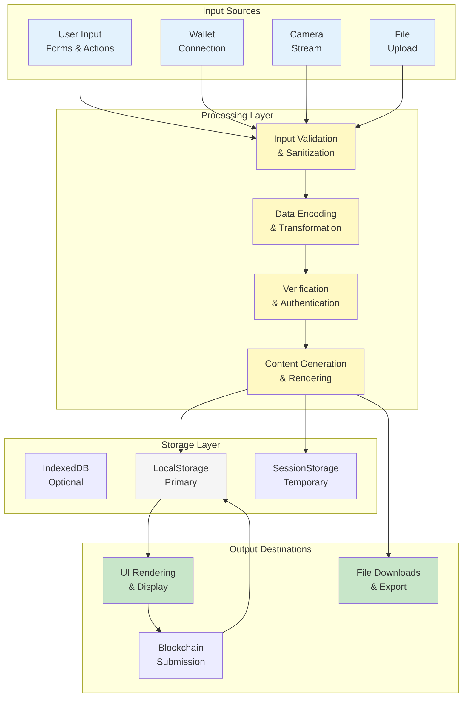

---

## 6. Face Recognition Pipeline

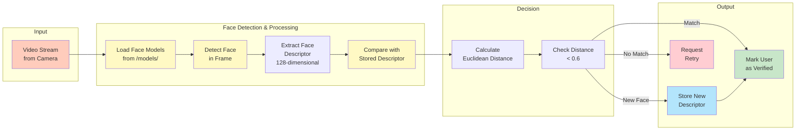

---

## 7. Certificate Generation Canvas Architecture

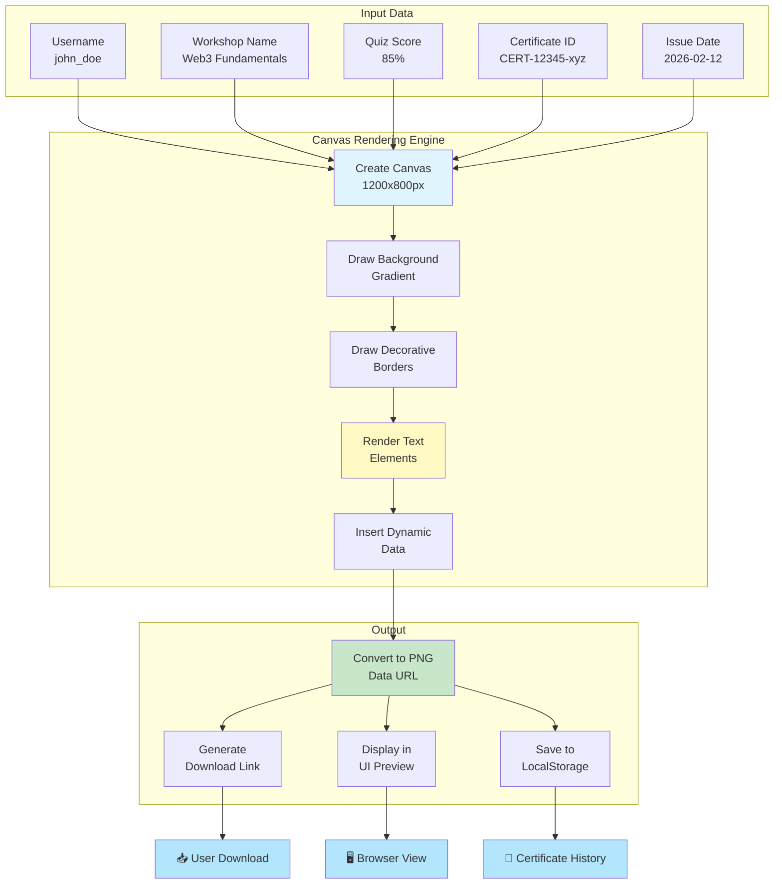

---

## 8. User Authentication & Role-Based Flow

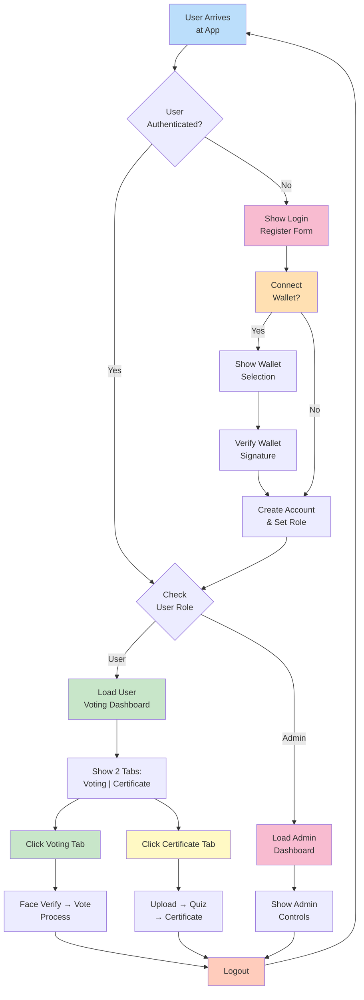

---

## 9. LocalStorage Data Structure

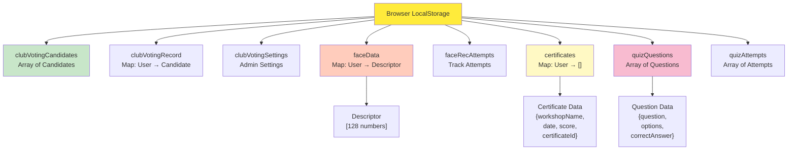

---

## 10. Complete User Journey Map

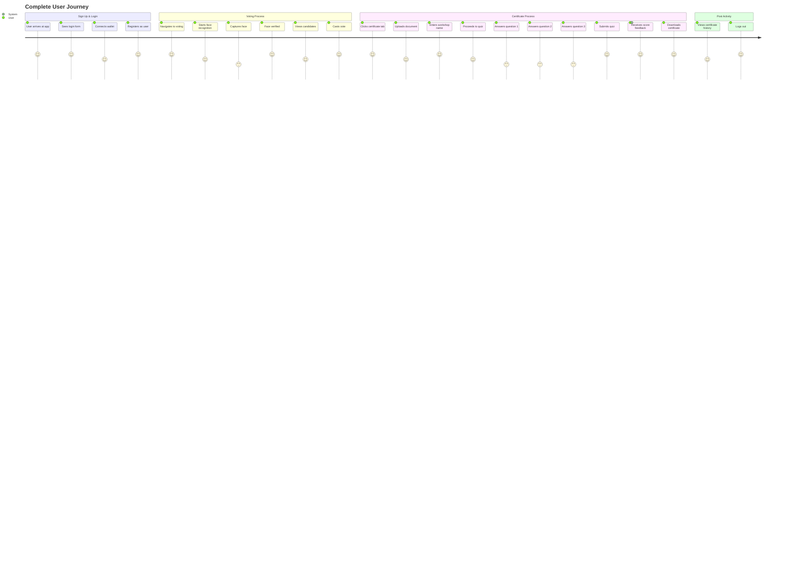

---

## System Statistics

| Component | Type | Count | Status |
|-----------|------|-------|--------|
| React Components | UI | 12+ | ✅ Active |
| Utility Files | Logic | 6+ | ✅ Active |
| Smart Contracts | Blockchain | 2 | ✅ Deployed |
| Quiz Questions | Content | 3 | ✅ Customizable |
| Storage Types | Data | 3 | ✅ Integrated |
| API Endpoints | Network | 4+ | ✅ Connected |

---

## Technology Stack

```
Frontend:
├── React 18.2
├── TypeScript 5.1
├── Tailwind CSS + DaisyUI
├── Face-API (Face Recognition)
└── Vite (Build Tool)

Smart Contracts:
├── Python (PyTeal)
├── Algorand
└── AlgoKit

Storage:
├── LocalStorage (Primary)
├── Canvas API (Generation)
└── Session Cache (Temporary)

APIs:
├── Algod (Node)
├── Indexer (Query)
├── KMD (Wallet)
└── Face-API (Browser ML)
```

---

## Key Integration Points

### 1. **Wallet Connection**
- User connects Algorand wallet (Pera, Defly, etc.)
- Transaction signing enabled
- Address retrieved for blockchain interactions

### 2. **Face Recognition**
- Models loaded from `/public/models/`
- Real-time face detection via camera
- Descriptor storage in LocalStorage

### 3. **Voting Smart Contract**
- ClubVotingClient interacts with blockchain
- Vote submission via signed transaction
- Result indexing for display

### 4. **Certificate Generation**
- Canvas API creates visual certificate
- PNG export for download
- Metadata stored in LocalStorage

### 5. **Quiz Engine**
- Questions loaded from storage
- Real-time scoring
- Attempt tracking

---

## Error Handling Flow

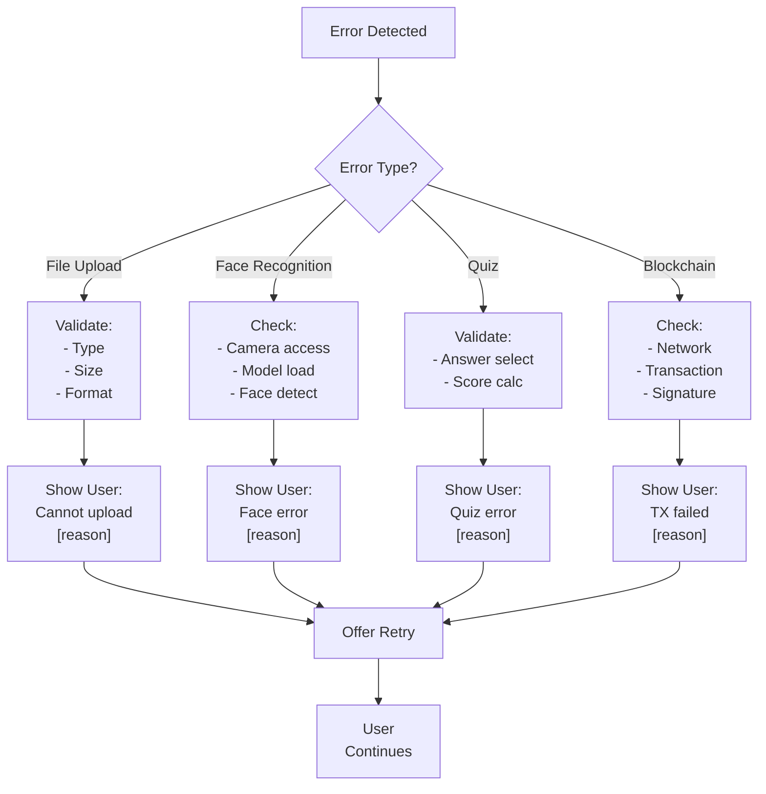

---

**Last Updated:** February 12, 2026
**Version:** 2.0
