# System Architecture & Workflow Diagrams

## 1. Overall System Architecture


---

## 2. Component Architecture Diagram


---

## 3. Voting System Workflow


---

## 4. Certificate Generation Workflow


---

## 5. Data Flow Diagram


---

## 6. Face Recognition Pipeline


---

## 7. Certificate Generation Canvas Architecture

```mermaid
graph TB
    subgraph "Input Data"
        USERNAME["Username<br/>john_doe"]
        WORKSHOP["Workshop Name<br/>Web3 Fundamentals"]
        SCORE["Quiz Score<br/>85%"]
        CERT_ID["Certificate ID<br/>CERT-12345-xyz"]
        DATE["Issue Date<br/>2026-02-12"]
    end
    
    subgraph "Canvas Rendering Engine"
        CANVAS["Create Canvas<br/>1200x800px"]
        BG["Draw Background<br/>Gradient"]
        BORDER["Draw Decorative<br/>Borders"]
        TEXT["Render Text<br/>Elements"]
        DATA["Insert Dynamic<br/>Data"]
    end
    
    subgraph "Output"
        PNG["Convert to PNG<br/>Data URL"]
        DOWNLOAD["Generate<br/>Download Link"]
        PREVIEW["Display in<br/>UI Preview"]
        STORE["Save to<br/>LocalStorage"]
    end
    
    USERNAME --> CANVAS
    WORKSHOP --> CANVAS
    SCORE --> CANVAS
    CERT_ID --> CANVAS
    DATE --> CANVAS
    
    CANVAS --> BG
    BG --> BORDER
    BORDER --> TEXT
    TEXT --> DATA
    
    DATA --> PNG
    PNG --> DOWNLOAD
    PNG --> PREVIEW
    PNG --> STORE
    
    DOWNLOAD --> User["📥 User Download"]
    PREVIEW --> Browser["🖥️ Browser View"]
    STORE --> History["📜 Certificate History"]
    
    style CANVAS fill:#e1f5fe
    style TEXT fill:#fff9c4
    style PNG fill:#c8e6c9
    style User fill:#b3e5fc
    style Browser fill:#b3e5fc
    style History fill:#b3e5fc
```



---

## 8. User Authentication & Role-Based Flow


---

## 9. LocalStorage Data Structure


---

## 10. Complete User Journey Map


---

## System Statistics

| Component | Type | Count | Status |
|-----------|------|-------|--------|
| React Components | UI | 12+ | ✅ Active |
| Utility Files | Logic | 6+ | ✅ Active |
| Smart Contracts | Blockchain | 2 | ✅ Deployed |
| Quiz Questions | Content | 3 | ✅ Customizable |
| Storage Types | Data | 3 | ✅ Integrated |
| API Endpoints | Network | 4+ | ✅ Connected |

---

## Technology Stack

```
Frontend:
├── React 18.2
├── TypeScript 5.1
├── Tailwind CSS + DaisyUI
├── Face-API (Face Recognition)
└── Vite (Build Tool)

Smart Contracts:
├── Python (PyTeal)
├── Algorand
└── AlgoKit

Storage:
├── LocalStorage (Primary)
├── Canvas API (Generation)
└── Session Cache (Temporary)

APIs:
├── Algod (Node)
├── Indexer (Query)
├── KMD (Wallet)
└── Face-API (Browser ML)
```

---

## Key Integration Points

### 1. **Wallet Connection**
- User connects Algorand wallet (Pera, Defly, etc.)
- Transaction signing enabled
- Address retrieved for blockchain interactions

### 2. **Face Recognition**
- Models loaded from `/public/models/`
- Real-time face detection via camera
- Descriptor storage in LocalStorage

### 3. **Voting Smart Contract**
- ClubVotingClient interacts with blockchain
- Vote submission via signed transaction
- Result indexing for display

### 4. **Certificate Generation**
- Canvas API creates visual certificate
- PNG export for download
- Metadata stored in LocalStorage

### 5. **Quiz Engine**
- Questions loaded from storage
- Real-time scoring
- Attempt tracking

---

## Error Handling Flow


---

**Last Updated:** February 12, 2026
**Version:** 2.0
